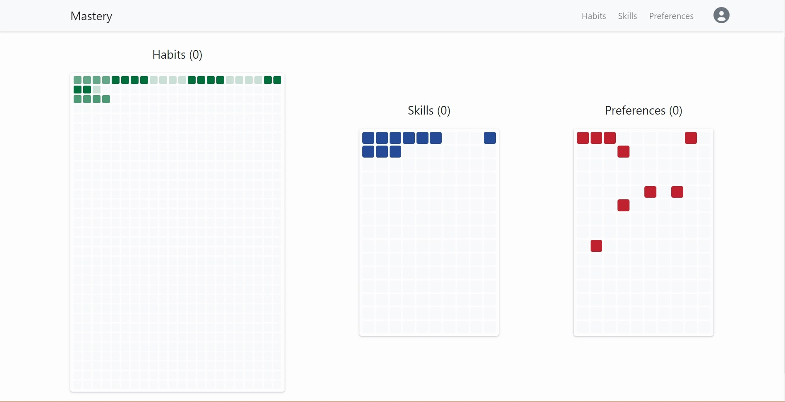
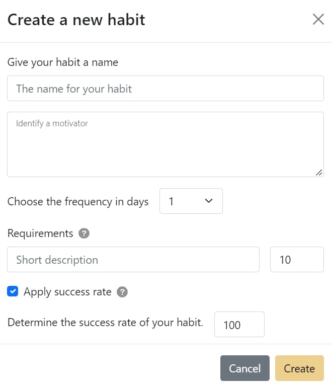
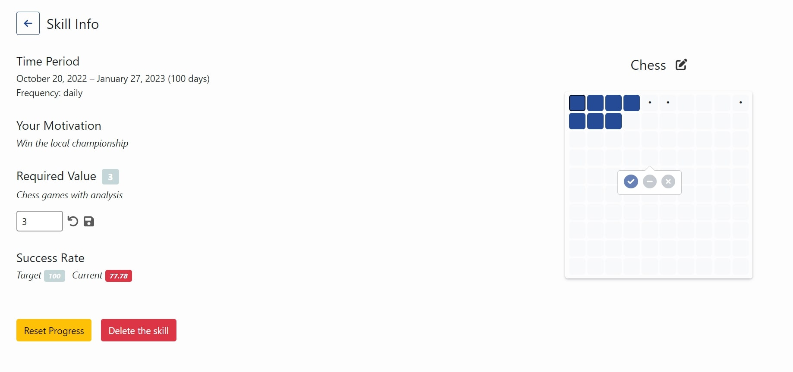
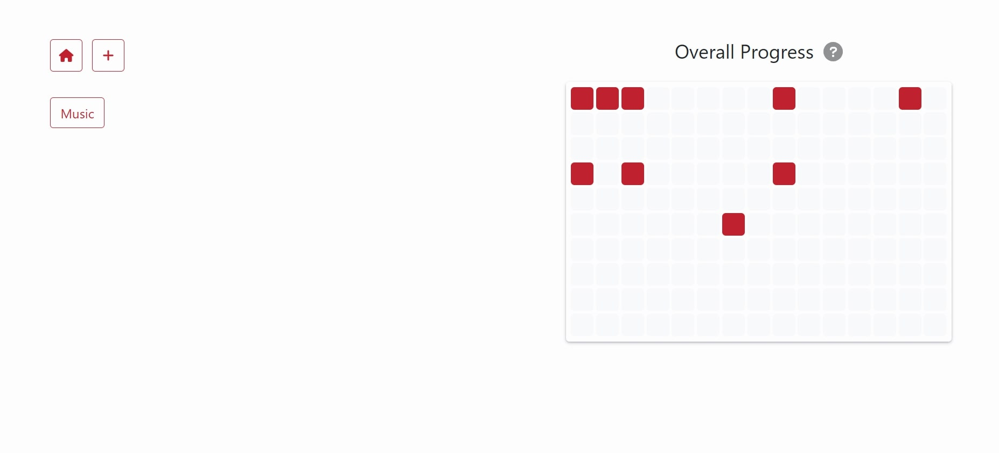
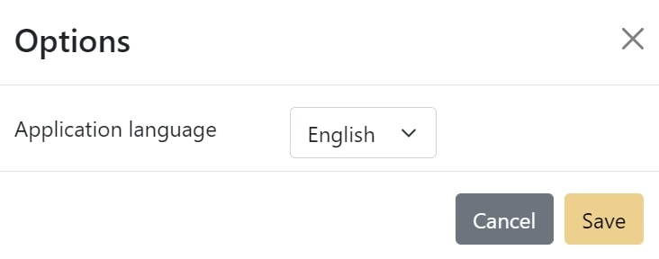

# Mastery - Develop good habits, improve your skills, and track your preferences

## Table of contents

- [Overview](#overview)
  - [The idea behind the project](#the-idea-behind-the-project)
  - [Application screenshots](#application-screeshots)
  - [Links](#links)
- [My process](#my-process)
  - [Built with](#built-with)
  - [Areas of improvement](#areas-of-improvement)
  - [Further development](#further-development)
  - [Useful resources](#useful-resources)
- [Author](#author)

## Overview

### The idea behind the project

I like to come up with different lifestyle systems, and here I decided to implement what I had in mind. The main idea was to motivate people by making them see how many days we have in our lives and what we can do with our time to make it more valuable in the moment. For this reason, I introduced 3 different heat maps to depict the frequency and intensity of certain daily activities. Also, I added the possibility of tracking your progress.

### Application screeshots

Overall heat maps

Habit creation modal

Skills dashboard

Preference heat map

Language options

### Links

- [Live Site URL](https://mastery-six.vercel.app/)

### Project features

- Creating a unique profile.
- Management of habits, skills and preferences for each user separately.
- Flexible settings for habits and skills.
- Heat maps for each created element.
- Support for 2 languages: English and Russian.
- Routing inside the app.

## My process

### Built with

- [Typescript](https://www.typescriptlang.org/) - a superset of JavaScript that adds optional static typing
- [React](https://reactjs.org/) - JS library
- [Create React App](https://create-react-app.dev/) - React meta framework
- [SCSS](https://sass-lang.com/) - CSS preprocessor
- [React-Bootstrap](https://react-bootstrap.github.io/) - Component library for React
- [react-i18next](https://react.i18next.com/) - an internationalization framework for React
- [React Router v6](https://reactrouter.com/en/v6.3.0/getting-started/overview) - a routing library for React

### Areas of improvement

Since I was building this app for more than a month, I got time to learn a lot of things. First of all, I used a custom component library that I had never used before. I also learned about internationalizing the application and how to use i18n to achieve it. Finally, I learned about new features in React v18 and React Router v6 and successfully applied them to this project.

I could also say I got better at TypeScript and SCSS. But here the results are not so tangible. In any case, below is a rough list of what I became better at.

- i18n
  - Understanding the principles of internationalization
  - Learning how to use i18next in React
- React Bootstrap
  - Using a custom component library in React
  - Overriding some styles to suit my needs
- React Router v6
  - Learning the differences between v5 and v6
  - Creating a multi-page application

### Further development

- Improving the design (there are too many blank spots in the app right now)
- Create a tutorial wizard (some features of the app might be hard to notice on your own)
- Add backend support (currently all data is stored in Local Storage, which isn't ideal)
- Add statistics for each user (e.g., achievements)
- Make the heat map more interactive (e.g., redirect to a specific day when you click on a cell)

### Useful resources

- [Cloud Convert](https://cloudconvert.com/jpg-to-webp) - For converting images to webp format that uses less space
- [Flaticon](https://www.flaticon.com/) - A huge collection of vector icons

## Author

- LinkedIn - [@ironwolf2000](https://linkedin.com/in/ironwolf2000)
- Second GitHub account - [@Bonrey](https://github.com/bonrey)
- Frontend Mentor - [@Bonrey](https://www.frontendmentor.io/profile/Bonrey)
